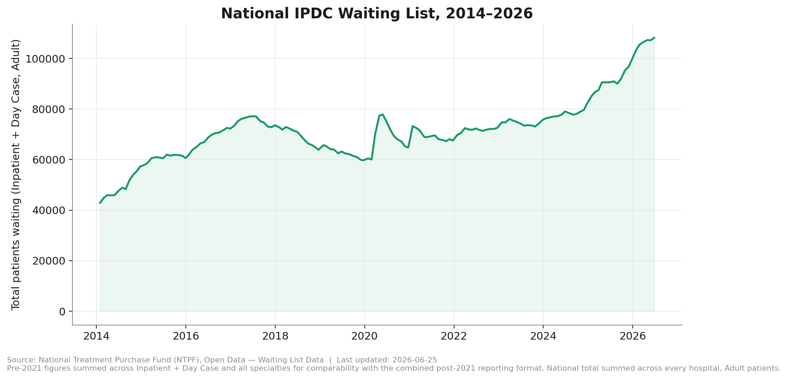
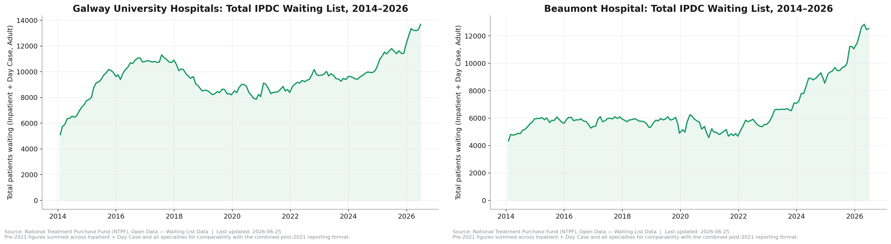
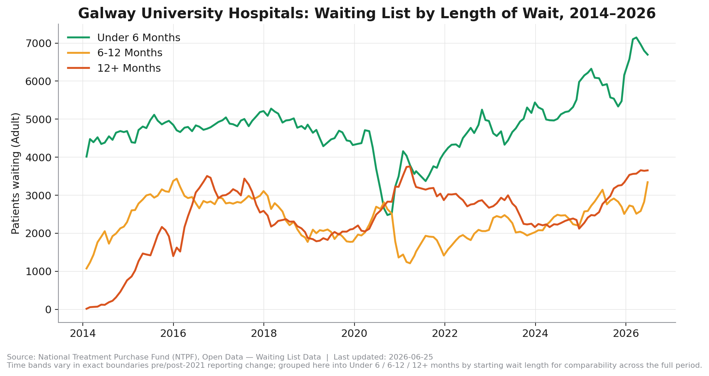
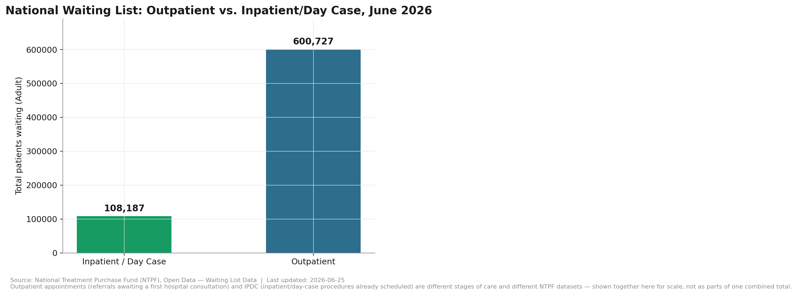

# Ireland's Hospital Waiting Lists Just Hit a 12-Year High

*Ireland in Data*

In June 2026, 108,187 adults were waiting for a hospital procedure in Ireland. Look at where that sits on the chart above: not a spike, not a blip — the highest point in the entire twelve-year record, surpassing even the previous peak back in 2017.

Every number and chart in this piece is reproducible from public NTPF data. [Explore the full interactive dashboard yourself](https://irishhealthdata.vercel.app/dashboard).

## Same record high, two different roads to it

Galway University Hospitals climbed steeply to 2017, fell back for three years, then climbed again — its current record is a *second* peak, not an unbroken rise. Beaumont Hospital did almost nothing for eight years — flat between 4,500 and 6,200 patients from 2014 to 2022 — then broke into an uninterrupted climb that has more than doubled its list in four years, with no plateau yet visible.

Both hospitals are at all-time highs. Neither got there the same way. A single national explanation likely doesn't fit both.

## During COVID, one hospital saw long waits overtake short ones

Ordinarily, short waits vastly outnumber long ones — that's what "waiting list" normally looks like. For a period in 2020–2021 at Galway University Hospitals, that flipped: more patients were waiting over 12 months than under 6. St. Vincent's and Cork show no such inversion across the same years.

That's a real, measured divergence between hospitals — not a uniform national story. What caused Galway specifically to invert, and not others, is an open question this dataset alone can't answer.

## Measured against Ireland's own targets

Sláintecare, the 2017 cross-party health reform plan agreed by the Houses of the Oireachtas, set maximum wait-time targets of 12 weeks for an inpatient/day-case procedure and 10 weeks for a new outpatient appointment ([Committee on the Future of Healthcare, *Sláintecare Report*, May 2017](https://data.oireachtas.ie/ie/oireachtas/committee/dail/32/committee_on_the_future_of_healthcare/reports/2017/2017-05-30_slaintecare-report_en.pdf)).

This project's own data can't verify current compliance against either target, at hospital or national level. NTPF's finest published time band for 2022 onward starts at "0–6 months" for both IPDC and Outpatient data — straddling both the 12-week and 10-week lines. We checked whether a more detailed NTPF file closes that gap. It doesn't: the "IPDC Waiting List Adult & Child Analysis" file restores a different breakdown (Inpatient vs. Day Case), not finer time bands. This is a known, documented limitation of the public data itself, not something this project's pipeline failed to extract — see Decision 007 in the project's Technical Design Document. Any specific compliance or breach figure would need to come from a source this project can independently re-verify each time it publishes, not just cite once — so rather than repeat a number we can't reproduce ourselves, we're flagging the measurement gap itself as the finding.

## For scale

Outpatient appointments — the *earlier* stage of care, before a procedure is even scheduled — total roughly 600,727 nationally. Over 5.5 times the inpatient/day-case list. The procedure backlog making headlines is the smaller of Ireland's two waiting-list problems.

## What this piece can't show you, and why

Specialty-level detail (orthopaedics, cardiology, etc.) only exists hospital-by-hospital for 2014–2021 — NTPF's current format doesn't publish that combination for recent years. Hospital names changed and merged over twelve years (three children's hospitals became Children's Health Ireland in 2019) and had to be reconciled by hand. One NTPF file contained an undocumented duplicate row per specialty that required verification against an independent total before it could be trusted.

None of it changes the headline finding. All of it — every script, every correction — is public: [github.com/plunkett140-dev/irishhealthdata](https://github.com/plunkett140-dev/irishhealthdata).

---

*Source: NTPF Open Data — Waiting List Data. Last updated: June 2026. Full methodology and known limitations: the project repository linked above. Causal interpretations in this piece are noted as such and are not established by the dataset alone.*
